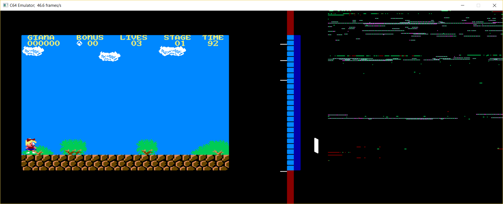

# C64 #

## About ##

This folder contains several C64 related projects. Among them are an emulator
for the 6510 processor, a C64 style intro that uses SDL2 and some useful code
for 2D games in general. And there's an actual C64 intro as well!

## The Last Intro ##

The folder [TheLastIntro](TheLastIntro/Readme.md "The Last Intro Readme") contains the (fist and) last intro that I create.
Just follow the link and check it out!

## Source Code ##

Just open the C64.sln with Microsoft Visual Studio and check out the
projects. There are also some experimental Android projects that use the
Android C++ project templates. Check out C64.Android.sln.

### SDL2 for Android ###

See the subfolder [SDL2](src/ThirdParty/SDL2/Readme.md "SDL2 Readme") for
instructions on how to compile SDL2 for Android using Visual Studio 2015.

### d64view ###

d64view is a d64 disk image viewer, it has its own solution file (see sub folder
C64/src/d64view). See more: [d64view Readme](src/d64view/Readme.md "d64view readme").

### GameClient2D ###

Some classes for a 2D game client that may (or may not) use paletted 8-bit
graphics. The library is based on my project MultiplayerOnlineGame.

### Intro ###

This is a C64 style intro implemented using SDL2. No actual C64 code, only the
C64 intro/demo style is used.

### Emulator ###

This is the start up project for a basic C64 emulator. Note that it isn't a
complete emulator, but more of an experimental toolkit to run parts of a C64
machine.

The application opens a window and tries to start the first SYS command. See

   Emulator.exe --help

for command line options:

   C64 Emulator

   Syntax: Emulator <params> <args>
   Options:
    -h -? --help
      Shows help
    -l --load
      loads specified tape (.t64) or program file (.p00)
    -e --entry
      specifies an entry number when loading a tape (.t64) file; specify * to load all entries from a tape image
    -f --fullscreen
      shows the emulator in fullscreen on start (toggle with Alt+Enter)
    -j --joystick
      enables port 2 joystick emulation via NumPad and Right-Ctrl keys
    -s --sys
      sets start program counter, in decimal (e.g. 2064) or hex ($0820, 0x0820)
    -d --debug
      runs emulator in debug mode, showing VIC and CPU status infos

During running emulator you have the following keyboard commands:

- Alt+Enter:  Toggle Fullscreen
- Alt+X:      Quit emulator
- Right-Ctrl: Joystick Port 2 Fire
- Num-Pad:    Joystick Port 2 directions

All other keys as mapped to a C64 keyboard.

So basically you load a tape or program file, specify a start program counter
(or let it detect the first SYS command in the file) and let it run. In debug
mode the emulator window gets bigger. The VIC state is visualized with some
bars in the middle of the screen, right to the C64 screen. And the rest of the
screen, on the right side, visualizes CPU activity.

#### Visualisation ####

#### VIC visualisation ####

The first column of the visualisations contains a white line when a VIC
interrupt occured in this rasterline.

The second column shows the VIC bad line condition:

- red: in upper or lower border
- black: bad line condition
- light blue: normal line, without bad line condition

The third column shows the VIC graphics mode:

- cyan: Bitmap mode, monochrome
- pink: Bitmap mode, multicolor
- yellow: Character mode, monochrome
- blue: Character mode, multicolor
- green: Character mode, extended multicolor

The remaining space shows vertical lines for each of the 8 sprites when they
are visible in the respective raster lines.

#### CPU visualisation ####

The CPU visualisation shows a CPU performance map for the whole C64 memory.
The performance map after the last raster line is reached, and so visualizes
what happens during a frame. The following colors are used:

- black: memory location wasn't used
- green: memory location was read from
- red: memory location was written to
- pink: opcode from memory location was executed

#### Screenshots ####

Here are some screenshots of games that already work.

Emulator running Elite:

Emulator running Giana Sisters:

During gameplay:

### Emulator.Logic ###

Static library that implements all the logic of a C64:

- MOS 6510 processor (only valid opcodes)
- VIC-II Video Interface Controller (not complete)
- CIA Complex Interface Adapter (not complete)
- Memory manager for the different memory banks

There are also some extra classes:
- PC64 file loader (.p00, .prg)
- Tape file loader (.t64)
- PETASCII string class

### Emulator.UnitTest ###

Unit tests for the Emulator.Logic classes. The unit tests are based on the C64
Emulator Test Suite, version 2.14, available here:

    http://8bitfiles.net/cbm/crossplatform/ALLFILES.html
    (look for filename tsuit214.zip)

The zip archive has to be extracted into the folder C64\src\Emulator\UnitTest\
The path to the file can be specified in the file TestEmulatorSuite.cpp.

Most tests are run by the C++ Unit Tests, except for some timing tests, CIA
tests and illegal 6510 opcode tests.
