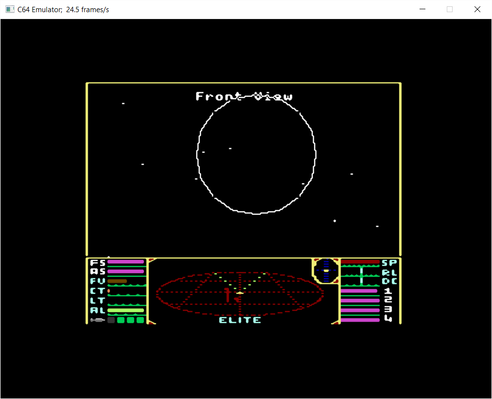
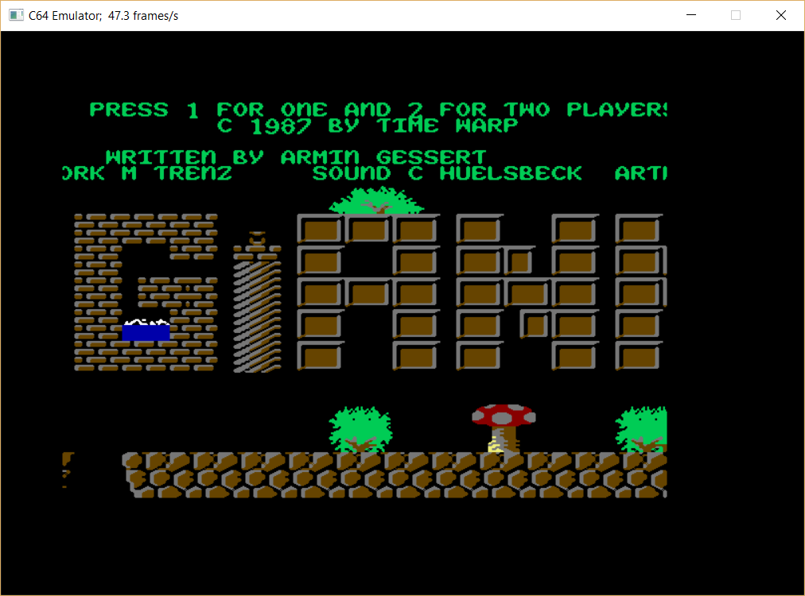
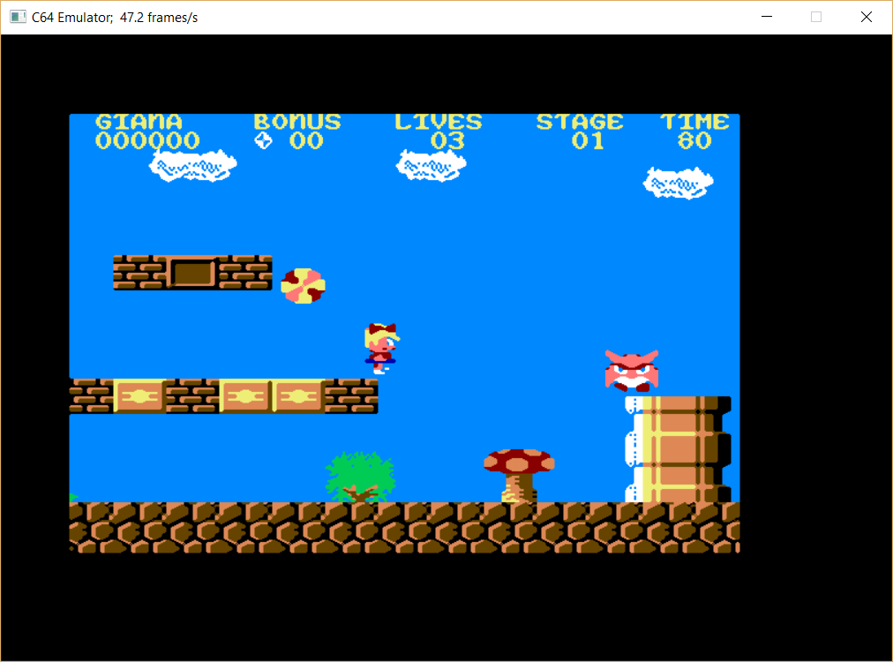

# C64 #

## About ##

This folder contains several C64 related projects. Among them are an emulator
for the 6210 processor, a C64 style intro that uses SDL2 and some useful code
for 2D games in general.

## Source Code ##

Just open the C64.sln with Microsoft Visual Studio 2015 and check out the
projects.

### d64view ###

d64view is a d64 disk image viewer, it has its own solution file (see sub folder
C64/src/d64view). See more: [d64view Readme](src/d64view/Readme.md "d64view readme").

### GameClient2D ###

Some classes for a 2D game client that may (or may not) use paletted 8-bit
graphics. The library is based on my project MultiplayerOnlineGame.

### Intro ###

This is a C64 style intro implemented using SDL2. No actual C64 code, only the
C64 intro/demo style is used.

### Emulator ###

This is the start up project for a basic C64 emulator. The project opens a
window and tries to start the first SYS command. See

   Emulator.exe --help

for command line options. During running emulator you have the following keyboard
commands:

- Alt+Enter:  Toggle Fullscreen
- Alt+X:      Quit emulator
- Right-Ctrl: Joystick Port 2 Fire
- Num-Pad:    Joystick Port 2 directions

All other keys as mapped to a C64 keyboard.

#### Screenshots ####

Here are some screenshots of games that already function

Emulator running Elite:

Emulator running Giana Sisters:

During gameplay:

### Emulator.Logic ###

Static library that implements all the logic of a C64:

- MOS 6510 processor (only valid opcodes)
- VIC-II Video Interface Controller (not complete)
- CIA Complex Interface Adapter (not complete)
- Memory manager for the different memory banks

There are also some extra classes:
- PC64 file loader (.p00, .prg)
- Tape file loader (.t64)
- PETASCII string class

### Emulator.UnitTest ###

Unit tests for the Emulator.Logic classes. The unit tests are based on the C64
Emulator Test Suite, version 2.14, available here:

    http://8bitfiles.net/cbm/crossplatform/ALLFILES.html
    (look for filename tsuit214.zip)

The zip archive has to be extracted into the folder C64\src\Emulator\UnitTest\
The path to the file can be specified in the file TestEmulatorSuite.cpp.

Most tests are run by the C++ Unit Tests, except for some timing tests, CIA
tests and illegal 6510 opcode tests.
