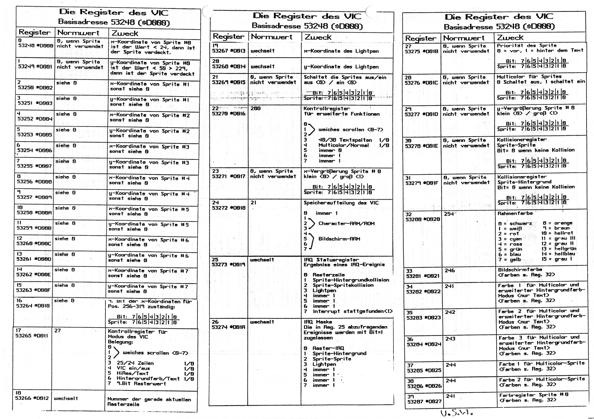

# C64 docs

Here are some rare to find documents about C64 programming.

[opcodes02.html](opcodes02.html): Documentation of all C64 opcodes and their
timings.

[VIC article](vic-article_html_engl/): Article about VIC internals

[C64 ROM listing](https://github.com/mist64/c64rom): annotated listing of C64
basic and kernal ROM.

: List of VIC registers, from german 64er
magazine.
