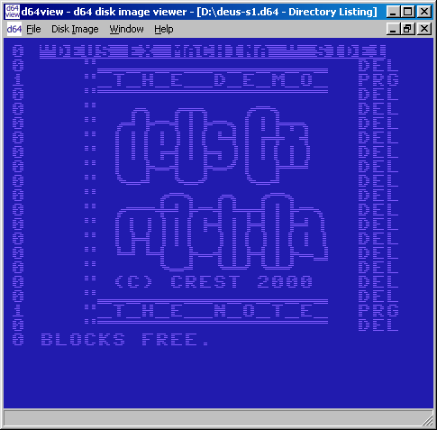

# Readme File for d64view - a d64 disk image viewer #

d64view shows d64 disk image contents, such as file directory, block
availability map and error codes. It handles several widely used disk
image formats, such as d64, d81, etc.

d64view (C) 2002,2003,2016 Michael Fink

d64view is licensed under the BSD 2-Clause License

https://github.com/vividos/OldStuff/tree/master/C64
mailto:vividos at users.sourceforge.net

See the dev-notes for more infos: [dev-notes](docs/dev-notes.md "dev-notes")
