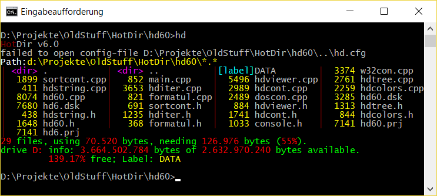
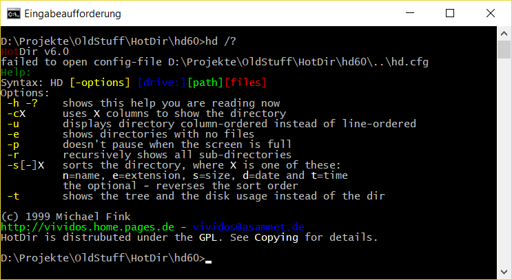
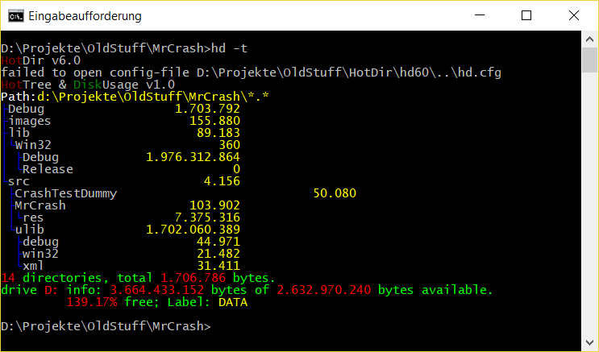

# HotDir #

## About ##

HotDir is a small command line program showing the current (or any) directory
in a colored way. The tool was first created in 1992 or 1993, after seeing a
similar tool (called di.com) and after getting Turbo C++ 3.1. The tool was
re-written several times, in order to improve executable size or number of
displayable files, or to support long filenames.

## HotDir 6.0 ##

The subfolder `hd60` contains the version HotDir 6.0. This version should be
compilable with Turbo C++ 3.1. There is a binary package of the compiled
version of HotDir in the "Releases" section of this github repository.

## Images ##

HotDir showing a directory:

HotDir showing command line help:

HotDir showing a directory tree and the disk usage:

The images were made with the hd32.exe that runs under Win32 but has several
bugs, e.g. loading of the hd.cfg doesn't work, and the drive info is reported
incorrectly.

## License ##

The original HotDir versions were licensed under the GPL License. As all of
the code in the "OldStuff" repository is licensed under the BSD 2-clause
license, I relicense the code of HotDir under the BSD 2-clause license, too.
