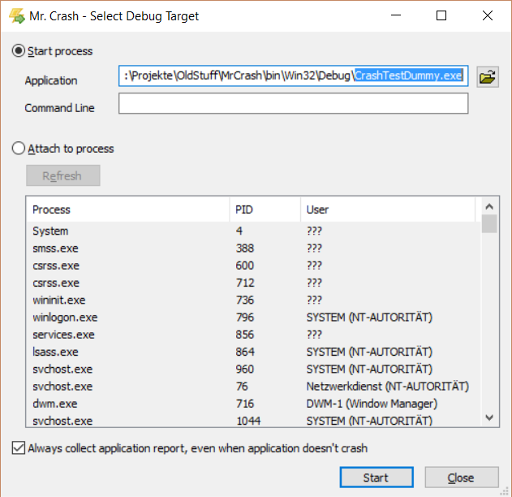
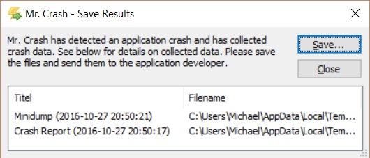
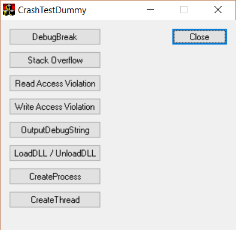

# MrCrash #

## About ##

MrCrash is a tool to analyse applications that may crash (e.g. the application closes without any
windows left, shows a "Windows Error Reporting" dialog or shows other crash-y behavior).

Error reporting information are collected then, and these infos can help developers to better
determine the reason of the crash.

## Download ##

You can download MrCrash here:

- [MrCrash-1.0.1.zip](https://github.com/vividos/OldStuff/releases/download/mrcrash-1.0.1/MrCrash-1.0.1.zip): MrCrash 32-bit + CrashTestDummy (225 kb)

Visit [https://github.com/vividos/OldStuff/releases]() for releases of all OldStuff projects.

## Screenshots ##

When Mr. Crash is started without an applicaton to monitor, the "Select debug target" dialog is
shown:

When the application to monitor has crashed, the following "Save results" dialog is shown:

To test MrCrash, a test application called CrashTestDummy is also supplied, to try out different
crashes:

## Technical Background ##

MrCrash acts as application debugger and records all debug events from the application. In case of second-chance exceptions (first-chance exceptions are normally handled by the application itself), app collected infos so far are written to an xml file. Additionally a minidump crash dump file (extension .mdmp) is created.

MrCrash needs admin privileges to debug applications, and when running under Windows Vista and above it therefore starts with an UAC prompt.
