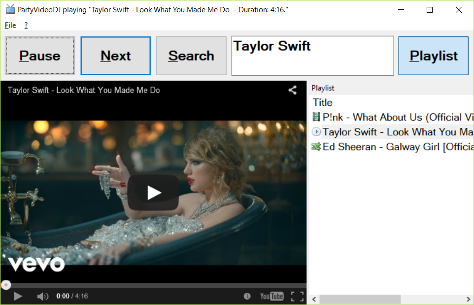

# PartyVideoDJ

PartyVideoDJ is a YouTube crossfading app designed to play music at parties!

Note: As of 2017 the tool doesn't work correctly anymore, as the YouTube
embedding API has changed. Searching for songs also doesn't work correctly.

## User Interface

The application user interface has four areas:

### Command bar

The command bar is always on top of the window and has the following buttons
and controls:

- Play / Pause: Starts playing the video, or pauses it when it already plays
- Next: Crossfades to the next video right now
- Search: Changes to the Search page; when the search page is already shown,
  changes back to the
- Edit line: Enter song/video names to immediately start searching for it
- Playlist: Shows or hides the current playlist.

### Playback View

The playback view shows the currently played video. When the video is about to
end, the volume is crossfaded to the next video, which was prepared in the
background.

### Search Page

The search page shows the YouTube search page and lets you enter song/video
names to search for. When a text was entered in the edit line, shows the
search results immediately. Clicking on a text link below a video adds the
video to the playlist.

## Playlist pane

The playlist pane shows the current playlist, with previously played songs,
the current song marked with a Play icon and the next songs. The playlist can
be reordered by drag-and-drop.
