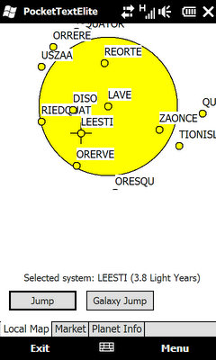

# PocketTextElite #

## About ##

PocketTextElite is a port of Ian Bell's TXTELITE.C sourcecode to Windows Mobile devices with ARM processor. It consists of the trading part of the original Elite game.

There also is a Windows Desktop version of the game.

Here's a link to Ian Bell's Text Elite page: [http://www.iancgbell.clara.net/elite/text/index.htm](http://www.iancgbell.clara.net/elite/text/index.htm "Ian Bell's Text Elite Page") 

## Download ##

You can download PocketTextElite here:

- [PocketTextElite-1.0.0.zip](https://github.com/vividos/OldStuff/releases/download/pockettextelite-1.0.0/PocketTextElite-1.0.0.zip): Windows Mobile (5.x/6.x) / Windows Desktop version (WinXP and above, 32-bit) (181 kb)  

If you use the Windows Desktop version, you need to install the Visual C++ 2012 Redistributable:
[http://www.microsoft.com/en-us/download/details.aspx?id=30679](http://www.microsoft.com/en-us/download/details.aspx?id=30679)

Visit [https://github.com/vividos/OldStuff/releases]() for releases of all OldStuff projects.

## Screenshots ##

Note: Screenshots were done on a 480x800 screen size device and were resized.

### Local Map ###

The Local Map shows the systems around the currently docked system. Clicking on a system marks the system for next hyperspace jump, and the Market and Planet Info are updated accordingly. Galaxy Jump jumps to the next galaxy (there are 8 galaxies). No misjumps for witchspace, sorry.

### Market ###

The Market shows quantities and prices of goods of currently docked station. It lets you buy and sell goods, as well as refill fuel for hyperspace jumps. When another system is selected on the Local Map, the average prices of this system are shown, but buying and selling is disabled.

### Planet Info ###

The Planet Info shows information about the currently selected system on the Local Map. The information should be the same as presented in the original game.

## Technical Background ##

The application uses Ian Bell's TXTELITE.c file (with some minor modifications) and wraps the C code with a C++ class. The game's screens use this class to retrieve planet and market infos and to draw the local map. Trading is done using the C++ class, too. The project uses WTL to implement the UI.