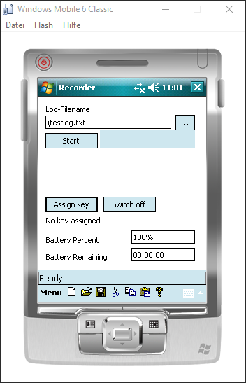

# Recorder #

## About ##

Recorder is an Windows Mobile application that records GPS tracks while
switching off the devices display in order to save power.

## Download ##

No download available yet.

Visit [https://github.com/vividos/OldStuff/releases]() for releases of all OldStuff projects.

## Screenshots ##

## Technical Background ##

The application is a WinCE project that must be opened and compiled using
either eMbedded Visual C++ 4.0 (still available here:
https://www.microsoft.com/en-us/download/details.aspx?id=16683) or Visual
Studio 2008 with the PocketPC 2003 SDK or the Windows Mobile 6 SDK installed.

The application most probably won't compile at this point, as there are some
files missing. The project also uses an early version of Boost and an early
version of UlibCpp that has some WinCE specific classes.

### How to compile ###

You need to download WTL and install the application wizard for Windows CE:
https://sourceforge.net/projects/wtl/
Download "WTL 9.1.5321 Final"; WTL 10 won't work, as it removed the WinCE
support.

Extract the zip archive somewhere and open the wtl9.vsprops file. Adjust the
path to the "include" folder of the extracted zip archive. Optionally, if you
want the application wizard, go to the AppWizCE folder. There, you can
double-click the setup90.js and the script installs the application wizard.

You also need a version of Boost; the library doesn't need to be compiled.
Edit the boost.vsprops file and change the path to the Boost root folder.
