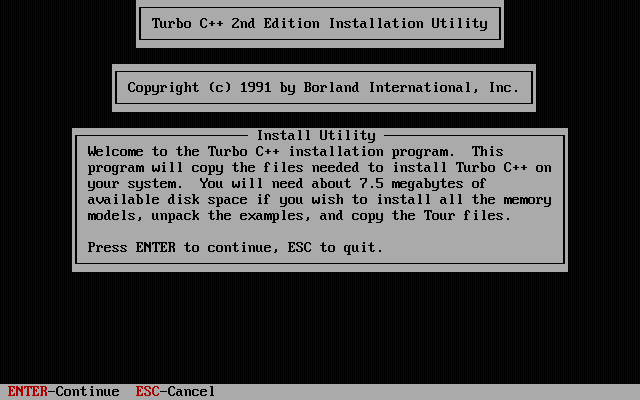
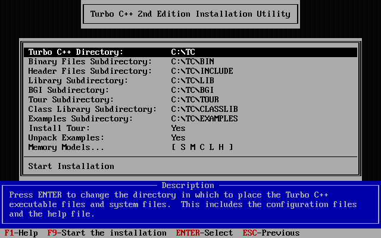

# Turbo C++ projects

This folder contains several ancient projects written using the Turbo C++ IDE.
All projects target 16-bit MS-DOS.

Note that this folder can be mounted in Dosbox as the C: drive and the
absolute paths used in the projects match perfectly.

All projects can be found in the `proj` folder. The following subfolders are
available:

- [shared](proj/shared/Readme.md): Contains some commonly used source files and unit tests
- lib: Contains pre-built static libraries to be linked to projects
- obj: Contains compiled .obj files
- bin: Contains the compiled output files

The following projects are available:

- [antchaos](proj/antchaos/Readme.md): Ant chaos application
- [cdp](proj/cdp/Readme.md): CD player application
- [feldlini](proj/feldlini/Readme.md): Feldlinien application
- [fractal](proj/fractal/Readme.md): Mandelbrot fractal drawing application
- [graphic](proj/graphic/Readme.md): Graphics mode static library
- [imgview](proj/imgview/Readme.md): Image viewer application
- [xmode](proj/xmode/Readme.md): static library implementing VGA Mode X

## Turbo C++ 1.01 setup

In order to install and run Turbo C++ you need Doxbox, which you can get here:
https://www.dosbox.com/
(you can also use any old 386 PC you can find lying around)

You also need to download Turbo C++ 1.01 from the Borlard Developer Network
Museum, conserved by the Archive:
https://web.archive.org/web/20050204085204/http://bdn.borland.com/museum

Unzip the tcpp101.zip into this folder. Then start Dosbox and mount this
folder as the C: drive, e.g. with this command:

    "C:\...\DOSBOX\dosbox.exe" -c "mount c ." -c "C:"

You can also use the `Run_TurboCpp.cmd` file provided here. You have to
adjust the dosbox path in the .cmd file.

Change into the `tcpp101` folder (`cd tcpp101`) and start the install
program.

Press enter to continue. The following screen appears:

Leave every option as is, as `C:\TC` is the expected path for Turbo C++.
Select `Start Installation` and wait until unpacking has finished.

As last step you can add the `C:\TC\BIN` path to the `PATH` environment
variable. The provided .cmd script also does that for you.

Finally, start Turbo C++ using `tc`.

## Turbo Assembler

For several projects, tasm is needed. The necessary `tasm.exe` isn't included
in Turbo C++ and must be obtained elsewehere.

A good overview of the tasm versions can be found here (no downloads, though):
https://bytepointer.com/tasm/index.htm
