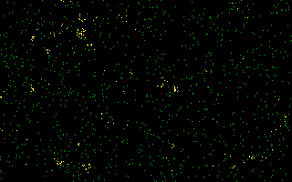

# Project antchaos

An example for graphics programming and also demonstrating that chaos creates
order. The black application screen hosts ants (red) and food (yellow) as
pixels. The ants are moved in a random direction each frame. When the ant
encounters food, it starts carrying the food and the ant turns green. When the
ant already carries food and encounters another food pixel, the old food is
dropped at the old place and the new food is picked up. While replacing food,
the ant turns blue for one frame. After running the simulation a long time,
the food pixels may form patterns or aggregate in the middle of the screen.

The parameters `AMEISENANZAHL` and `NAHRUNGSANZAHL` can be adjusted to set
different starting values.

The project uses Mode X and swaps the screen after each simulation step.
