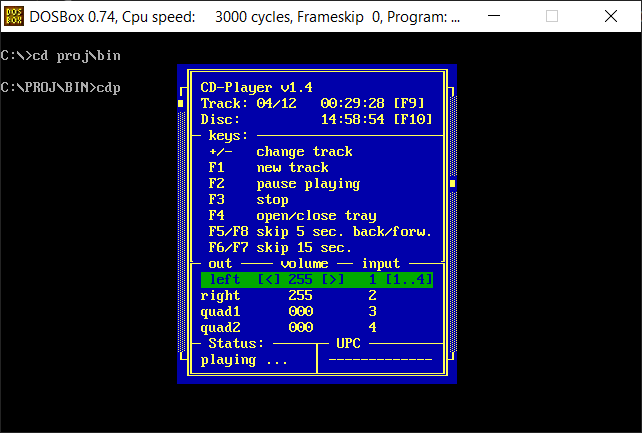

# Project cdp

The `cdp` application is a small CD player that lets you control CD playback
and displays infos about the CD playback.

The application uses `MSCDEX` to talk to the CD-ROM drive to control and get
infos. If you run the application under dosbox, be sure to mount the CD-ROM
drive like this:

    Z:\>MOUNT D D:\ -t cdrom

The application shows a window with several elements. The top part shows the
currently played track and track/disc times. Times can be inverted by using F9
and F10 keys. The next part shows further keys. When pressing F1, a new track
number can be entered manually.

The lower part lets you adjust volume and
output channel mapping using cursor keys and keys 1 to 4. The bottom of the
window shows the current playing status and the 13-digit UPC number of the CD,
when available. CD audio continues playing even when the application is exited
via Esc.

The application also has some command line switches, which can be displayed
using `cdp -help`:

    CD-Player v1.4 Help
    Options:
      -info     get info about mscdex and cd
      -trackXX  play track XX
      -pause    pause cd-playing (and resume)
      -stop     stop playing cd
      -open     open or close cd-tray
      -upc      scan Universal Product Code at start

All options except the last one just carry out the action without starting the
CD player.
