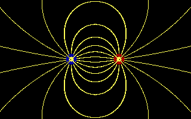

# Project feldlinien

This is a project for a "skilled work" project done in the 11th class in
physics. The project lets you set electrically changed points and traces the
electric field lines by tracing the vectors that have the most permittivity:
https://en.wikipedia.org/wiki/Vacuum_permittivity

The resulting image is a drawing of point charges and the electrical field
lines:

(red circles are positive charges, blue are negative charges)