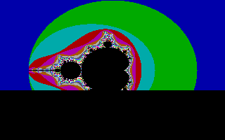

# Project fractal

Calculates a Mandelbrot fractal and draws it using VGA Mode X. When the user
presses a key, the rendering stops. At the end of calculating the fractal, the
user has to press a key again to return back to DOS.

