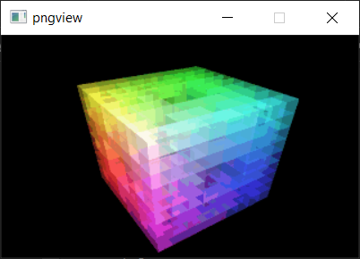

# README for altpng

## About

altpng was a C library project that attempted to have a smaller and leaner way
to read PNG files, compared to libpng, and to experiment with the then-new PNG
format. The original introduction text was:

    altpng is an alternative library to read and write png images. altpng
    allows for more flexibility by providing more ways to access png files,
    including chunk level support, scanline decoding and decoding whole
    files.

The library can be built using Visual Studio 2019 (or later), into a shared
library `altpng.dll` or a static library `altpng_static.lib`. The common
header `altpng.h` can be generated using a Perl script `altpng.pl`. There is
also a C style unit test project called `altpngtest` and two tools `pngmin`
and `pngview`, half complete.

The library also contains some project files to be used for `autoconf` and
`automake`, and in principle the library was also usable on Linux. Now the
files are just there for software archeology purposes.

The library was, at the time of creation, licensed using the LGPL, but I
switched the license to the BSD 2-clause license for the OldStuff project.

## Images

This is the `pngview` application, showing the `colorcube.png` test image:

## Build

The altpng project is using the zlib and SDL external libraries. Those can be
installed on the development system using `vcpkg`:
https://github.com/Microsoft/vcpkg

After setting up vcpkg, the libraries can be downloaded using this command:

    vcpkg install zlib sdl1

When the vcpkg integration was done at setup, the include and lib folders of
these libraries should be automatically found when building altpng.
